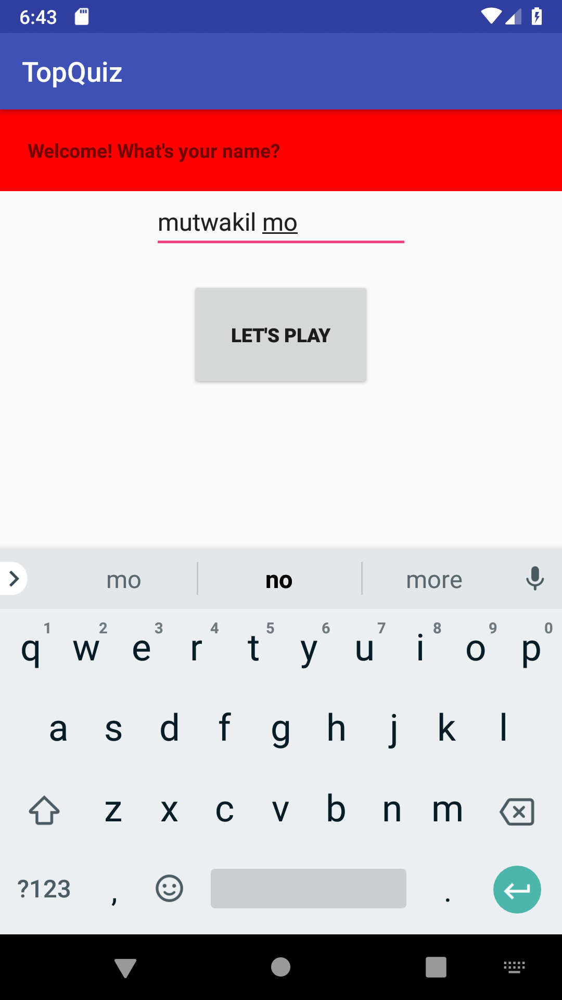
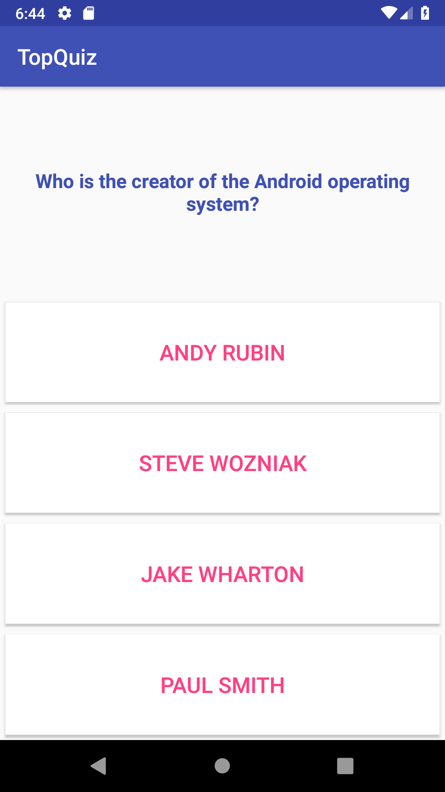

# TopQuiz
TopQuiz Android App for OpenClassrooms

## Screenshots

&ensp;

## **Project learning goals:**

 - Identify and integrate basic layout components
 - Use basic widgets in a layout
 - Identify and use the main functions in Android Studio
 - Create new activities and indicate which ones the OS should launch
 - Identify the main components of the MVC model and their functions
 - Use the MVC model to organize your code
 - Use widgets to communicate with users
 - Manage the lifecycle of an application and its components
## Libraries Used

* [Android Support Library](https://developer.android.com/topic/libraries/support-library/)

## Developed By

[**Mutwakil Mo**](https://mutwakilmo.netlify.com/)

## License

    Copyright 2019 Mutwakil Mo

    Licensed under the Apache License, Version 2.0 (the "License");
    you may not use this file except in compliance with the License.
    You may obtain a copy of the License at

         http://www.apache.org/licenses/LICENSE-2.0

    Unless required by applicable law or agreed to in writing, software
    distributed under the License is distributed on an "AS IS" BASIS,
    WITHOUT WARRANTIES OR CONDITIONS OF ANY KIND, either express or implied.
    See the License for the specific language governing permissions and
    limitations under the License.
